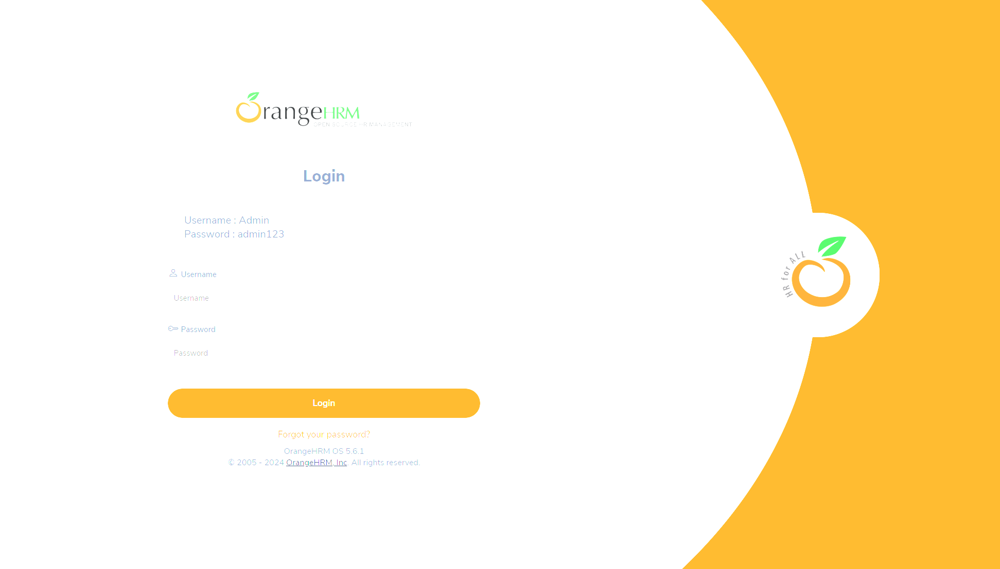
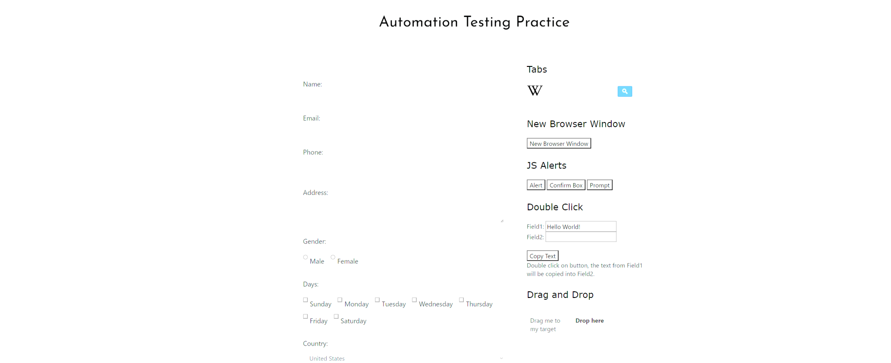

# SeleniumProjectBasics
Selenium project consisting of multiple scripts with each script exercising test automation practices/methodologies and key selenium webdriver library usage. Proficiency in web testing using Selenium is displayed through meticulous test automation design, robust scripting, and elaborate test case execution. Project encapsulates not only technical competence but a commitment to quality asurance and efficient software design. 

Scripts test multiple selenium functions and test automation practices against websites such as:
* Open Source Project orangehm: https://github.com/orangehrm/orangehrm
  
* Open Source Project nopCommerce:[ https://demo.nopcommerce.com](https://github.com/nopSolutions/nopCommerce)](https://github.com/nopSolutions/nopCommerce)
  
* Demo Website: https://testautomationpractice.blogspot.com
 

